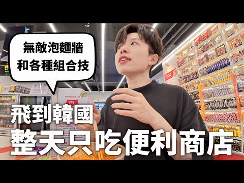
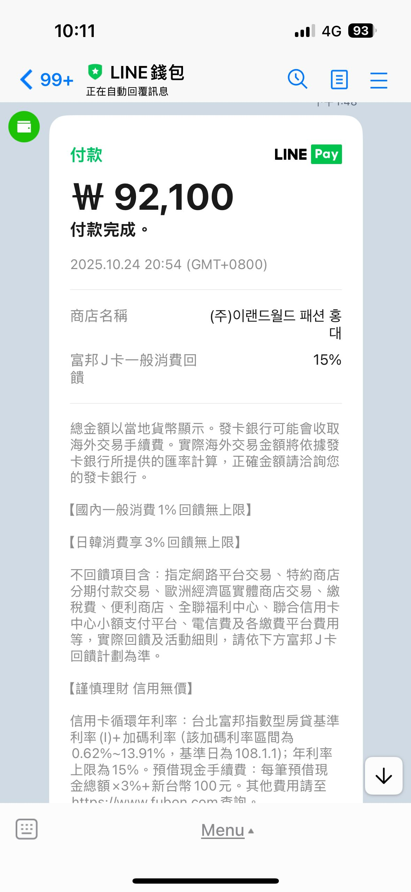

# 🇰🇷 2025 韓國旅遊終極攻略筆記 (網友討論精華版)

這份筆記整理自多篇熱門討論串，包含最新的支付策略、退稅技巧、必買好物與美食推薦。

---

## 💳 支付與省錢攻略 (2024 第四季 - 2025)

### 1. 支付方式「黃金三角」策略
網友一致推薦，不要只依賴一種支付方式，根據不同場景切換最划算：

#### 👑 王者：LINE Pay (大額消費、免稅店、百貨)
*   **核心優勢**：回饋率最高，疊加後可達 **15% ~ 30%**。
*   **最佳組合**：**LINE Pay + 中信 LINE Pay VISA 卡**。
*   **回饋公式 (第四季 10/1~12/31)**：
    1.  **基本回饋**：綁任一卡 5%。
    2.  **VISA 加碼**：綁 VISA 卡再加 10%。
    3.  **指定卡加碼**：綁中信 LINE Pay 卡再加 5% (共 20%)。
    4.  **大額加碼**：單筆滿 19 萬韓元 (約 $4,400 台幣)，**再加 10%**。
    *   **總計**：最高可拿 **30% LINE POINTS 回饋**！
*   **適用通路**：樂天免稅、新羅免稅、CU、樂天超市、SPAO、ABC Mart、愛寶樂園等。
*   **網友實測**：
    *   買 Chanel 精品，回饋近 30%，等於打 7 折再加退稅，超級划算。
    *   **⚠️ 重要避雷**：**額度有限！** 網友回報 10 月份「樂天百貨」的 LINE Pay 回饋額度已滿，去之前要有備案（實體卡）。

#### 🏪 便利商店神隊友：台灣 Pay / 全支付
*   **台灣 Pay**：
    *   **主攻**：CU、GS25、7-11 等便利商店。
    *   **優勢**：**15% 回饋** (有上限)，且免海外手續費。
    *   **建議**：小額消費（買飲料、零食）全部用這個，把回饋拿好拿滿。
*   **全支付 (Quan Pay)**：
    *   **優勢**：透過 HIVEX 或 ZeroPay 系統，筆筆享 **3.5% 無上限**回饋。
    *   **定位**：適合當作備用，或是在台灣 Pay 額度用完時使用。

#### 🍽️ 吃飯與逛街：Apple Pay / 實體卡
*   **策略**：路邊攤、餐廳或不支援上述支付的地方。
*   **建議**：挑選海外回饋高的信用卡（如富邦 J 卡、國泰 CUBE 卡）綁定 Apple Pay 或直接刷實體卡。

---

## ✈️ 旅遊實用資訊

### 📅 最佳旅遊季節
*   **春季 (3-5月)**：賞櫻、踏青。
*   **夏季 (6-8月)**：海水浴、音樂節。
*   **秋季 (9-11月)**：賞楓、氣候涼爽。
*   **冬季 (12-2月)**：滑雪、逛聖誕市集。

### 📱 必備 APP
1.  **Naver Map**：韓國版 Google Map，導航必備。
2.  **Kakao T**：叫計程車、交通付款。
3.  **Papago**：韓文翻譯神器，比 Google 翻譯準確。
4.  **Subway Korea**：地鐵路線圖＋時刻表。
5.  **MangoPlate**：韓國版 Yelp/愛食記，找美食評價。
6.  **Catch Table**：餐廳訂位神器，想吃熱門餐廳（如山清烤肉）必備。

### 💰 省錢小撇步
*   **交通卡**：購買 T-money 卡搭公車、地鐵都能折扣。
*   **換匯**：可在台灣先換部分韓元，其他帶台幣/美金到明洞換錢所補足（匯率較好）。
*   **住宿**：避開旺季假日，選地鐵站附近小旅館或 guesthouse。
*   **退稅**：善用「自助退稅機」，不用在機場大排長龍。

---

## 🛍️ 必買好物與穿搭建議

### ❄️ 雪地裝備 (冬季必看)
*   **雪靴推薦**：網友大推 **迪卡儂 (Decathlon)** 的雪靴。
    *   **優點**：防水、防滑、好走，直接踩水也沒問題。
    *   **避雷**：很多人不推 UGG 類雪靴，在結冰路面（如銀山溫泉、韓國滑雪場）容易滑倒。
*   **老奶奶背心 (Grandma Vest)**：
    *   **趨勢**：韓星帶起的復古風潮，市場姨母賣的碎花/鋪棉背心。
    *   **實測**：網友分享零下 1 度穿著身體依然暖呼呼，保暖度極佳又可愛。

### 🛒 購物熱點
*   **廣藏市場 (Gwangjang Market)**：
    *   除了買棉被，附近還有「潮牌一條街」。
    *   **位置**：昌慶宮路 88 號，西門 1 樓 270 號店鋪 (營業時間 09:00-19:00)。
*   **聖水洞 (Seongsu-dong)**：
    *   **必買麵包**：Beton。攻略：一進去先找位子坐下再去排隊，內用比外帶快。
    *   **購物**：有很多潮牌店和選物店。
*   **便利商店必買 (CU)**：
    *   **綠色**：生命源泉 (抗疲勞)。
    *   **藍色**：植物性褪黑素 (助眠)。
    *   **黃色**：有機蘋果醋 (抑制食慾)。
    *   **紫色**：葡萄柚濃縮液 (幫助排便)。
    *   *網友建議：去韓國大吃大喝容易水土不服，這 4 款可以收藏備用。*

---

## 🍽️ 美食推薦
*   **弘大美食**：**正直的金先生 (Ba-reun Kim Teacher / 바르다김선생)**
    *   網友推薦的必吃名單，主打健康的紫菜包飯和餃子。
*   **便利商店美食**：
    *   HOOK 影片推薦的各種神祕組合技（影片內容），例如特定泡麵加起司等。
*   **明洞美食**：
    *   網友建議明洞夜市小吃單價偏高 (約 6000 韓元)，不如直接去吃韓式烤肉 (五花肉、豬頸肉) 更划算滿足。
*   **布帳馬車**：
    *   體驗氣氛很棒，但價格偏貴。
    *   *避雷*：辣白菜煎餅不要點，網友表示有「難過的味道」。

---

## ✈️ 更多旅遊實用資訊 (新)

### 機場與飛航規定
*   **行動電源**：搭乘飛機時，特別是韓籍航空（如易斯達航空），記得在行動電源的接頭/端口貼上**絕緣膠帶**。有些航空公司如果貼了膠帶可能就不需要用夾鏈袋。長榮航空被提及不需要這樣做。
*   **SES 自動通關**：
    *   建議申請，不要被「外國人入境」的排隊人潮嚇到。
    *   有辦的人直接告知服務人員，最裡面有 SES 自動通關通道，可以越過一般排隊區域。

### 行程建議
*   **機場鐵路 (AREX)**：
    *   **直達車 (橘色)**：直達首爾站，較貴，不停弘大。
    *   **普通車 (藍色)**：會停弘大，車程約 50 分鐘，適合住弘大的旅客。
*   **樂天樂園**：
    *   還是需要快速通關券。
    *   建議 18:00 後入場，排隊人潮會比較少。

---

### 📝 綜合懶人包 (請直接照做)

1.  **出發前準備**：
    *   確認 **LINE Pay** 已綁定 **中信 LINE Pay VISA 卡** (或其他 VISA 卡)。
    *   下載並開通 **台灣 Pay** (綁定銀行帳戶)。
    *   下載 **Catch Table** 訂位。
    *   準備一張海外回饋高的**實體信用卡**備用。
    *   冬天去記得買迪卡儂雪靴。
    *   **行動電源接頭貼絕緣膠帶** (搭韓籍航空必備)。
    *   申請 **SES 自動通關**。

2.  **消費當下判斷**：
    *   **便利商店** ➔ 打開 **台灣 Pay** (拿 15%)。
    *   **免稅店/買鞋/買衣服 (SPAO/ABC Mart)** ➔ 打開 **LINE Pay** (湊滿 19 萬韓元拿 30%)。
    *   **吃飯/路邊攤** ➔ 刷 **實體卡** 或 **Apple Pay**。

3.  **注意事項**：
    *   LINE Pay 回饋有「總預算上限」，月底去可能會有活動額度已滿的風險，記得關注最新狀況。
    *   單筆滿 19 萬韓元才有最高回饋，建議可以和朋友**湊單結帳**。

---

## 🔗 參考來源 (Source Links)

本攻略整理自以下網友熱心分享，點擊連結可查看原文討論：

### 📺 影片

 
[HOOK ft. 全支付 - 韓國便利商店好吃到讓人哇哩咧](https://youtu.be/hSPZVv1-J5M?si=3SBiNWAjiQPPYzoj)

### 🧵 Threads 討論串

| 預覽 (Preview) | 標題 (Title) |
| :---: | :--- |
|  | [@tan_ni_jung - 韓國刷卡回饋攻略](https://www.threads.com/@tan_ni_jung/post/DQYGBK3j5q3) |
|  | [@yunfei_224 - 買 Chanel 刷 LINE Pay](https://www.threads.com/@yunfei_224/post/DRPSxDeEoti) |
|  | [@windko.tw - 韓國 LINE Pay 活動詳解](https://www.threads.com/@windko.tw/post/DPP1-7jEl_x) |
|  | [@johnlin50 - 2025 韓國消費建議](https://www.threads.com/@johnlin50/post/DPRlj7uD09u) |
|  | [@kkrseoul24 - 樂天百貨 LINE Pay 額度滿了](https://www.threads.com/@kkrseoul24/post/DRXMZSDgSpa) |
|  | [@albee5433 - 老奶奶背心實測](https://www.threads.com/@albee5433/post/DRlr3rSkyz6) |
|  | [@roolez553 - 韓國旅遊分享](https://www.threads.com/@roolez553/post/DRUyL8ICQpm) |
|  | [@kipi89876 - 旅遊心得](https://www.threads.com/@kipi89876/post/DFJktB2z8Lj) |
|  | [@sandyy_booku - 旅遊筆記](https://www.threads.com/@sandyy_booku/post/DQY-AEQjzuW) |
|  | [@queenmwin - 旅遊分享](https://www.threads.com/@queenmwin/post/DRW1QPqiaV_) |
|  | [@nanisince2012 - 旅遊心得](https://www.threads.com/@nanisince2012/post/DRZOc8ikrIX) |
|  | [@nellydyu - 弘大正直的金先生](https://www.threads.com/@nellydyu/post/DRcXT96EqLx) |
|  | [@takaselect - 行動電源與美妝](https://www.threads.com/@takaselect/post/DRe3JVviaQ5) |
|  | [@_pppci._ - 行程規劃心得](https://www.threads.com/@_pppci._/post/DRe0EAlk1v6) |
|  | [@sunnythinthin - 明洞夜市建議](https://www.threads.com/@sunnythinthin/post/DReno59EhS1) |
|  | [@two_tai_tai - 旅遊分享](https://www.threads.com/@two_tai_tai/post/DRe8OTAE3SW) |
|  | [@ig_rich99chu - 旅遊心得](https://www.threads.com/@ig_rich99chu/post/DRebnxjkkkd) |
|  | [@anna_zhu0610 - 旅遊分享](https://www.threads.com/@anna_zhu0610/post/DRle-EgAVpF) |
|  | [@beurlife.tw - 聖水洞 Beton 麵包](https://www.threads.com/@beurlife.tw/post/DRn1qDOj86r) |
|  | [@hanni1415_ - 樂天樂園攻略](https://www.threads.com/@hanni1415_/post/DRqNgrFEq6m) |
